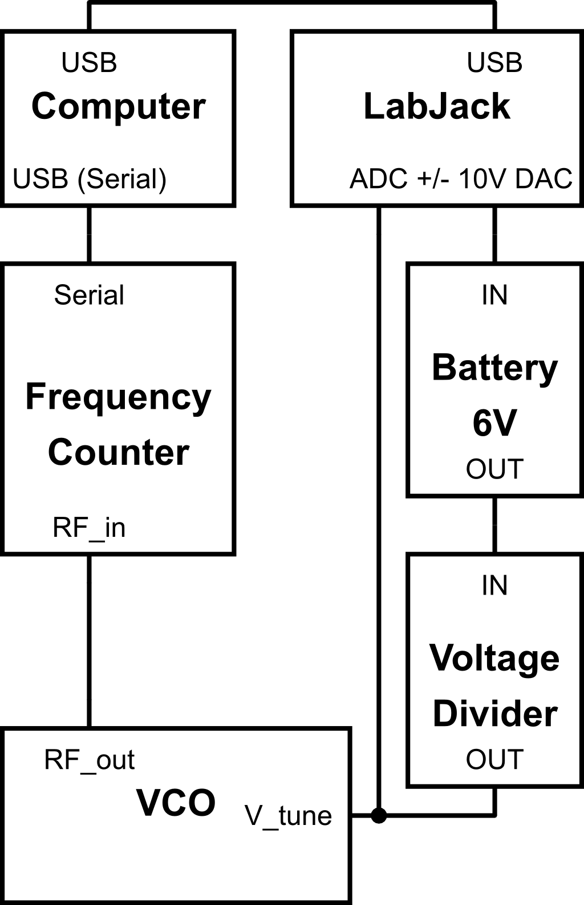

# Measuring VCO frequency as a function of VCO control voltage
This repository includes scripts for measuring frequency as a function of control voltage and an attempt to fit the calibration data using both ODR and least squares methods.

## Hardware
1. LabJack T7 with a $\pm$10V DAC attachment. The LabJack is used to sweep the control voltage. It also measures the control voltage seen by the VCO.
2. Battery pack for producing a 6V offset.
3. [B&K 1856D frequency counter](https://www.bkprecision.com/products/frequency-counters/1856D).
    * [1856D_datasheet.pdf](https://bkpmedia.s3.us-west-1.amazonaws.com/downloads/datasheets/en-us/1856D_datasheet.pdf)
    * [1856D_manual.pdf](https://bkpmedia.s3.us-west-1.amazonaws.com/downloads/manuals/en-us/1856D_manual.pdf) (see section 3.7 on how to communicate with the counter)
4. VCO
5. Voltage divider

## Calibration code
This repository includes the following scripts:
* `makeCalibration.py`: This script makes the calibration by first setting an output voltage on the LabJack, measuring the voltage after the battery and voltage divider and measuring the VCO frequency using the frequency counter.
* `FrequencyCounter/main.cpp`: Code for communicating with the frequency counter using a serial port. This can "in theory" be done in python but I ran into some issues on Linux and python where the frequency counter would not be recognized by the device. It turns out that this is because for the counter to send a signal, the USB pins need to be configured properly (`DTR` needs to be on, and `RTS` needs to be off. Both are always on by default, which prevents the device from being seen).
    * Uses [serialib](https://lucidar.me/en/serialib/cross-plateform-rs232-serial-library/) which is a C++ library for communicating with serial devices.
    * The code should work fine on Windows and Linux, barring the issue of the DTR and RTS ports

## Analysis code
To convert the measured data to a voltage-frequency calibration I tried different methods of fitting the data with polynomials (linear, quadratic and sixth order):
* `completeCalibration_LeastSquares.py`
    * Fit using least squares. Does not take errors of measured voltage into account (x-errors).
* `completeCalibration_ODR.py`
    * Fit using [ODR (Orthogonal Distance or Deming Regression)](https://en.wikipedia.org/wiki/Deming_regression). Does take errors of measured voltage into account (x-errors).
Aside from the fitting method and the implementation of the model functions the two scripts are virtually identical.
A comparison between the two methods can be found in my [report](https://github.com/fklose/Term-Report/blob/main/main.pdf).

## Setup
